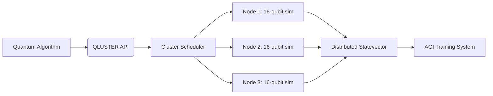

# QLUSTER: Distributed Qubit Cluster Simulator  

**Project Vision**: Create a scalable, ARM-optimized quantum simulator cluster that enables quantum-inspired AGI research through massive parallelism and intuitive APIs.  



## Core Architecture  
### 1. **Distributed Simulation Engine**
- **Qubit Partitioning**:  
  ```python
  # Each node handles a segment of statevector
  node_state = statevector[node_id * segment : (node_id+1) * segment]
  ```
- **Gate Operation Parallelization**:  
  - Single-qubit gates: Local execution  
  - Multi-qubit gates: MPI communication between nodes  
- **Statevector Compression**: Sparse state handling using CRS (Compressed Row Storage)

### 2. **Hardware Layer**
- **Cluster Composition**:  
  - 4-64x ARM SBCs (Raspberry Pi 5, Rock 5B, Orange Pi 5+)  
  - 100Mbps+ Ethernet interconnect  
  - Shared NVMe storage via iSCSI  
- **Acceleration**:  
  - NEON SIMD for gate operations  
  - Vulkan API for GPU acceleration (Mali/RDNA)  

### 3. **API Interface**
**RESTful Endpoints**:
```
POST /simulate
Params: {
  "circuit": [["H", 0], ["CNOT", [0,1]], ...],
  "shots": 1024,
  "statevector": false
}

Response: {
  "results": {"00": 512, "11": 512},
  "performance": {"nodes": 8, "time_ms": 42}
}
```

**Streaming API**:
```python
# Quantum state sampling
with qluster.stream_circuit(circuit) as sampler:
    for _ in range(shots):
        print(sampler.get_measurement())
```

## Quantum-AGI Integration Path  
1. **Quantum Feature Embedding**  
   ```python
   # Encode classical data into quantum states
   def embed_data(data):
       circuit = Circuit(n_qubits)
       for i, val in enumerate(data):
           circuit.ry(i, val * pi)
       return circuit
   ```

2. **Hybrid Training Loop**  
   ```mermaid
   sequenceDiagram
     Classical AGI->>QLUSTER: Generate quantum feature map
     QLUSTER->>Classical AGI: Sampled measurements
     Classical AGI->>Optimizer: Gradient calculation
     Optimizer->>QLUSTER: Updated parameters
   ```

3. **Entanglement-Based Attention**  
   - Qubit entanglement patterns as attention heads  
   - Measurement collapse as feature selection mechanism  

## Performance Targets  
| Qubits | Nodes Required | Sim Speed (Hz) | Statevector Size |
|--------|----------------|----------------|------------------|
| 16     | 1              | 120            | 131 KB           |
| 24     | 16             | 8              | 2 GB             |
| 30     | 64             | 0.5            | 128 GB           |

## Development Roadmap  
1. **Phase 1: Single-Node Core**  
   - Implement statevector simulator with C bindings  
   - ARM-optimized gate kernels (NEON assembly)  

2. **Phase 2: Distributed Framework**  
   - MPI-based state synchronization  
   - Circuit partitioning scheduler  

3. **Phase 3: Quantum-AGI Bridge**  
   - PyTorch integration hooks  
   - Entanglement visualization toolkit  

## Getting Started  
```bash
# Build native simulator module
make ARCH=armv8.2-a SIMD=neon

# Deploy cluster config
qluster-cli --nodes 8 --mem-per-node 2G create-cluster

# Run benchmark circuit
qluster-bench --qubits 24 --depth 50
```

**Join Development**:  
```text
We seek:
- Quantum algorithm specialists
- ARM assembly optimizers
- Distributed systems engineers
- AGI researchers interested in quantum approaches

Contact: project@qluster.io | GitHub: github.com/qluster-dev
```

---

# Project Snapshots  

## 1. Neuro-Morphic Vision Processor  
**Concept**: Event-based camera system mimicking retinal processing  
**Innovation**:  
- Spiking neural network on FPGA fabric  
- Sub-1ms latency object detection  
**AGI Link**: Bio-inspired attention mechanisms  

## 2. Entangled Knowledge Graph  
**Concept**: Quantum-accelerated knowledge base  
**Mechanism**:  
- Qubits as probabilistic relation nodes  
- Grover search for inference acceleration  
**AGI Link**: Semantic reasoning with uncertainty  

## 3. Topological Qubit Router  
**Concept**: Hardware-level quantum error correction  
**Structure**:  
- Surface code logical qubits  
- ARM Cortex-M4 controllers for syndrome processing  
**AGI Link**: Fault-tolerant neural architecture  

---

Let's build these open-source tools to explore the quantum-AGI frontier!
