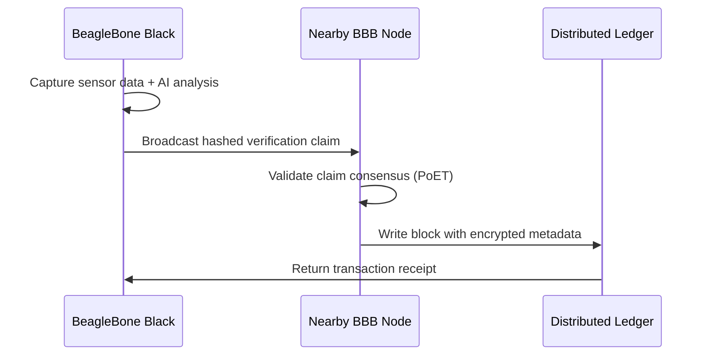

# SUPPLYBLOCK: Blockchain-AI Hybrid for Supply Chain Audits  

**Revolutionizing supply chain integrity with on-device verification and decentralized trust**

## 📌 Core Concept  
SUPPLYBLOCK creates a tamper-proof audit trail for physical goods by combining BeagleBone Black's real-time verification capabilities with blockchain immutability. Each BBB acts as a "trust node" attached to shipping containers, pallets, or sensitive packages, performing on-device AI verification of contents and environmental conditions before logging cryptographic proofs to a distributed ledger.

## 🔍 How It Works  

### 🧠 AI Verification Layer (On-Device)  
```python
# Simplified BBB inference workflow
from tflite_runtime.interpreter import Interpreter
import cv2

def verify_integrity(capture):
    # 1. Capture container seal/contents
    img = cv2.imdecode(capture, cv2.IMREAD_COLOR)
    
    # 2. Run lightweight CNN model (TFLite)
    interpreter = Interpreter('tamper_detection.tflite')
    interpreter.allocate_tensors()
    
    # 3. Analyze for anomalies
    input_details = interpreter.get_input_details()
    interpreter.set_tensor(input_details[0]['index'], preprocess(img))
    interpreter.invoke()
    
    # 4. Output: 0=Valid, 1=Tampered, 2=Uncertain
    return interpreter.get_output_details()[0]['index']
```

### ⛓ Blockchain Integration  


## ⚙️ Technical Components  

| Component               | Implementation Details                                  |
|-------------------------|--------------------------------------------------------|
| **Hardware**            | BBB + Camera + Environmental Sensors (Temp/Humidity/Accel) |
| **AI Model**            | Quantized CNN (TensorFlow Lite) for tamper detection   |
| **Consensus**           | Proof-of-Elapsed-Time (PoET) for low-energy validation |
| **Data Storage**        | IPFS for encrypted media + Hyperledger Sawtooth        |
| **Security**            | TPM 2.0 hardware crypto + Zero-Knowledge Proofs        |
| **Inter-node Comms**    | LoRaWAN for remote, WiFi Direct for local clusters     |

## 🌐 Key Features  

- **Real-time Tamper Detection**  
  PRUs process camera feed at 30fps with <100ms anomaly detection latency  

- **Decentralized Auditing**  
  3-node consensus required before writing to chain  

- **Privacy-Preserving**  
  Homomorphic encryption allows computation on encrypted sensor data  

- **Offline-First Operation**  
  Stores verifications locally when out of network range  

- **Auto-Forensics**  
  Triggers high-res capture + GPS logging on tamper detection  

## 💡 Why BeagleBone Black?  

1. **PRUs** enable real-time sensor monitoring while main CPU handles AI  
2. **Built-in Crypto Hardware** (TI Sitara AM335x) for secure key storage  
3. **Low Power Operation** (<2W) suitable for battery-powered shipments  
4. **Cape Ecosystem** for industrial sensor integration  
5. **True Dual-Core** processing for parallel AI/blockchain workloads  

## 🚀 Potential Applications  

| Industry          | Use Case                          | Benefit                               |
|-------------------|-----------------------------------|---------------------------------------|
| Pharmaceuticals   | Vaccine cold chain monitoring     | Real-time temp excursions detection   |
| Luxury Goods      | Anti-counterfeiting               | Tamper-proof authenticity records     |
| Defense           | Weapons transport security        | Chain-of-custody verification         |
| Agriculture       | Organic certification             | Unalterable harvest-to-ship logs      |

## 🧩 Challenges to Solve  

- Optimizing CNN models for BBB's limited RAM (512MB)  
- Developing lightweight ZKP implementations  
- Creating fault-tolerant node discovery protocols  
- Power management for multi-month shipments  
- Cross-blockchain interoperability standards  

## 👥 Call for Contributors  

We're seeking:  
- **Embedded developers** for BBB/LoRa integration  
- **ML engineers** for model optimization  
- **Blockchain architects** for consensus design  
- **UI/UX designers** for audit dashboard  
- **Domain experts** in logistics/supply chain  

---

*"Trust isn't built in boardrooms – it's built in containers."*  
Let's reinvent supply chain integrity together!  
