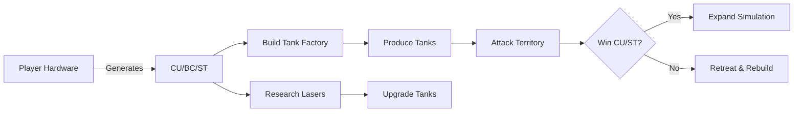

# COREWARS: Distributed Processing Strategy Game  
*(Concept Snapshot v1.0)*  

## 🌌 Core Vision  
A massively multiplayer strategy game where players' **real-world computational resources** (Raspberry Pi clusters, gaming rigs, servers) directly power their in-game civilization. Economy and war are driven by raw processing power, creating a decentralized "invest-to-advance" ecosystem blending hardware tinkering with grand strategy.  

---

## ⚙️ Key Mechanics  

### 1. **The Physical Layer ("Reactor Core")**  
- **Hardware = Power**: Players connect devices (RPIs, PCs, cloud VMs) via a lightweight client.  
- **Resource Types**:  
  - `Compute Units (CU)` - From CPU/GPU (e.g., FLOPs/sec)  
  - `Bandwidth Credits (BC)` - From network throughput  
  - `Storage Tokens (ST)` - From available RAM/disk  
- **Efficiency Matters**: Overclocking, bare-metal optimization, or custom cooling boosts output.  

### 2. **The Virtual Layer (Civilization)**  
| Resource  | In-Game Use Cases                          |  
|-----------|--------------------------------------------|  
| **CU**    | Unit production, research, resource harvesting |  
| **BC**    | Trade, troop movement, espionage           |  
| **ST**    | Territory expansion, blueprints, intel     |  

### 3. **War & Economy**  
- **Scaling Costs**: A tank costs `100 CU + 10 BC`. A *nuclear missile* costs `50,000 CU + 1,000 BC`.  
- **Territory**: Simulating 1km² land requires `X CU/sec`. Larger empires demand exponentially more resources.  
- **Battles**: Resolution fidelity scales with contributed CU (e.g., basic RNG vs. physics simulations).  

### 4. **Alliances & Diplomacy**  
- **Shared Reactors**: Alliances pool CU/BC/ST (with cryptographic resource audits).  
- **Specialization**: GPU farms boost research; high-clock CPUs optimize espionage.  

---

## ⚖️ Balancing "Pay-to-Win"  
| **Advantage**          | **Counterbalance**                          |  
|-------------------------|---------------------------------------------|  
| Bigger hardware clusters | Diminishing returns on CU conversion        |  
| High-end GPUs           | Specialized tasks only (e.g., research)     |  
| 24/7 server farms       | Vulnerability during downtime/attacks       |  
|                         | "Citizen path" for small nodes (alliance roles) |  

---

## 🚀 Innovation Hooks  
- **Bare-Metal Leaderboards**: Ranked by CU/Watt or frames/sec/$  
- **Overclocker's Edge**: Stability bonuses for sustained high-clock runs  
- **Distributed Science**: Donate excess cycles to [Folding@home](https://foldingathome.org) for in-game rewards  
- **Moddable Client**: Community-built optimizations (e.g., ARM64 kernel tweaks)  

---

## 🔐 Technical Challenges  
| Challenge               | Proposed Solution                           |  
|-------------------------|---------------------------------------------|  
| **Cheating**            | Hybrid PoW + redundant task verification    |  
| **Hardware Heterogeneity** | Task tiering (e.g., "GPU-only physics jobs") |  
| **Network Spikes**      | CU/BC buffering during offline periods      |  
| **Central Authority**   | Lightweight coordinator for world state     |  

---

## 🌟 Why Developers Should Care  
1. **Novel Fusion**: Bridges real-world tech (distributed systems, hardware hacking) with persistent strategy.  
2. **True Scalability**: Game complexity grows with player count/hardware.  
3. **Open Ecosystem**: Potential for community-driven clients, mods, and hardware profiles.  
4. **Educational Angle**: Teaches resource optimization, cryptography, and parallel computing.  

---

## 📜 Example Workflow  

---
