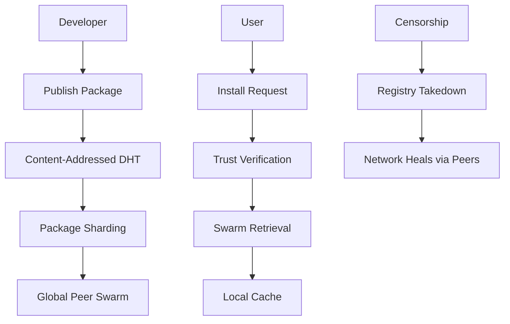
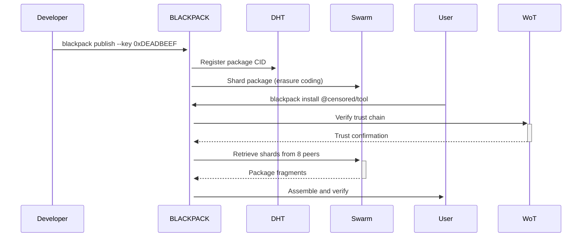
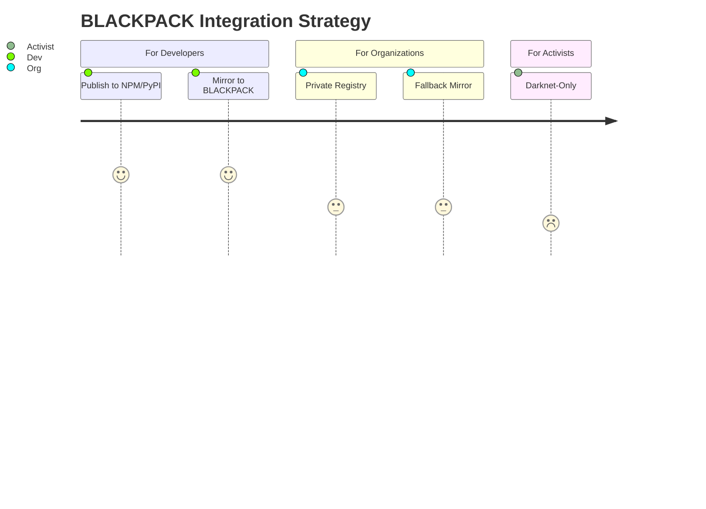
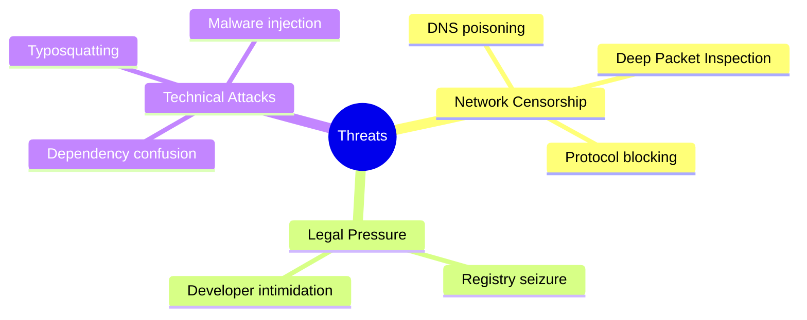

# BLACKPACK: Uncensorable Dependency Ecosystem

> **Surviving the digital siege**  
> *Where packages persist when repositories fall*

## 🌑 Core Concept
BLACKPACK creates a decentralized, censorship-resistant package ecosystem where:
- Dependencies survive registry takedowns and internet blackouts
- Packages are verified through a decentralized Web of Trust
- Distribution occurs via darknet-friendly protocols
- Developers maintain productivity under digital siege

Inspired by: `BitTorrent`'s resilience + `GPG`'s trust model + `IPFS`'s content addressing

## ⚙️ Technical Architecture


### 🔐 Key Mechanics
| Component                  | Implementation Details                  | Censorship Resistance |
|----------------------------|-----------------------------------------|------------------------|
**Content Addressing**     | Multihash-based CID (IPFS)              | Tamper-proof artifacts |
**Distributed Hash Table** | Kademlia DHT with darknet extensions    | No central index       |
**Web of Trust**           | Decentralized PKI with trust chains     | No certificate authority|
**Conflict Resolution**    | Semantic versioning with conflict DAGs  | Handles fork wars      |
**Stealth Protocol**       | Pluggable transports (Meek, Obfs4)      | Evades deep packet inspection |

## 🌍 Why This Matters
```diff
+ Venezuela 2019: npmjs.com blocked during protests
+ Iran 2022: PyPI inaccessible to developers
+ Russia 2023: GitHub restricted amid sanctions
+ Future: All major repositories could become targets
```

## 🛡️ Real-World Applications
1. **Sanctioned Regions Development**  
   - Maintain software supply chains during internet blackouts
2. **Secure Infrastructure Provisioning**  
   - Deploy servers with verified dependencies in hostile networks
3. **Contingency Toolchain**  
   - Backup package system for critical infrastructure
4. **Whistleblower Development**  
   - Build and distribute tools under surveillance

## ⚙️ Tech Stack
```bash
Core:         Rust (libp2p, ipfs-embed)
Networking:   libp2p with stealth transports
Storage:      IPFS + Filecoin for incentivized persistence
Security:     Age encryption + Minisign verification
UI:           CLI with npx-compatible syntax
```

## 🧩 Challenges & Solutions
| Challenge                  | Our Approach                     |
|----------------------------|----------------------------------|
**Sybil Attacks**          | Stake-weighted trust scoring     |
**Package Spoofing**       | Multi-signer Web of Trust        |
**Discovery in Darknets**  | Bootstrap node rendezvous system |
**Legal Risk**             | Package contents fully encrypted |
**Version Conflicts**      | Distributed conflict-free replicated data types (CRDTs) |

## 📦 Package Lifecycle


## 🚀 Adoption Path


## 🔒 Threat Model


## 👥 Join the Digital Resistance
We need:
- **Rust Engineers**: P2P networking specialists
- **Security Cryptographers**: Distributed trust systems
- **Infrastructure Experts**: Package management veterans
- **Localization Teams**: Documentation for high-risk regions

*"First they block GitHub, then they come for your compiler..."*

## Key Innovations

1. **Darknet-First Architecture**
   - Pluggable transports (Meek, Obfs4, Snowflake)
   - Protocol mimicry (disguised as video streaming)
   - Zero clearnet dependencies

2. **Decentralized Trust**
   - Web of Trust with trust chaining
   - Multi-signature package verification
   - Reputation-weighted voting

3. **Survival Mechanics**
   - Package sharding with erasure coding
   - Ephemeral bootstrap nodes
   - Dead-drop package distribution

4. **Conflict Resolution**
   - Distributed CRDTs for version management
   - Fork arbitration through staked voting
   - Automatic conflict graphs

## Technical Highlights

- **Compatibility Layer**: Wraps existing package managers (npm, pip, cargo)
- **Progressive Security**: Three security modes (clearnet, Tor, advanced obfs)
- **Zero-Config Fallback**: Automatically activates when main repos are unreachable
- **Forensic Protection**: No persistent logs, memory-only operations
