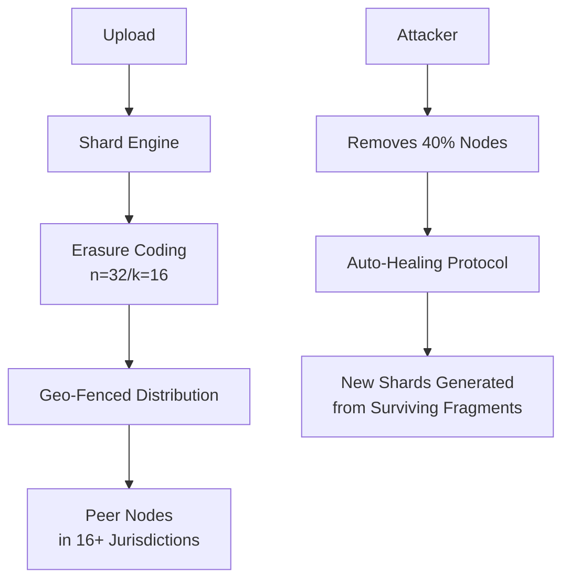
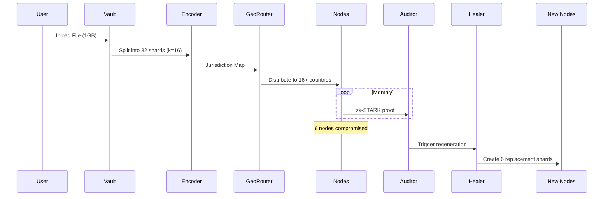
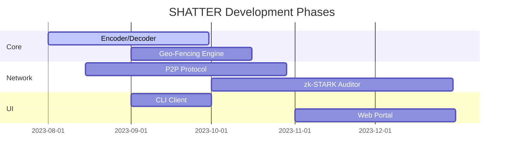

# SHATTER: Antifragile Data Vault

> **Jurisdiction-Proof Encrypted Storage**  
> *Where files don't just survive attacks - they get stronger*

## 🌪️ Core Principle
SHATTER implements a self-healing storage network where:
- Files become **more resilient** when attacked
- Data survives **coordinated takedowns** via jurisdictional sharding
- Storage nodes **never see complete files** or metadata
- The system **automatically repairs** lost fragments

Inspired by: `BitTorrent`'s resilience + `Hashicorp Vault`'s security + `RAID`'s redundancy

## 🔐 Technical Architecture


### 🧩 Key Components
| Component                  | Implementation Details                  | Security Advantage          |
|----------------------------|-----------------------------------------|-----------------------------|
**Quantum-Safe Encryption** | NTRU lattice-based crypto + AES-256-GCM | Post-quantum ready          |
**Jurisdictional Sharding** | Tor exit node geolocation + legal DB    | Avoids single legal domain  |
**Proof-of-Storage**        | Periodic zk-STARKs of shard possession  | Verifies hosts without decryption |
**Reputation System**       | Sybil-resistant node scoring            | Identifies malicious swarms |
**Healing Protocol**        | Reed-Solomon regeneration triggers at 25% loss | Always maintains k+n safety |

## 💥 Why "Antifragile"?
Traditional systems degrade under stress. SHATTER improves:
```diff
+ Under Attack:   Increases redundancy spread
+ Node Churn:     Discovers new geographies
+ Legal Demand:   Fragments migrate automatically
+ Censorship:     Darknet fallback activation
```

## 🛡️ Real-World Applications
1. **Journalistic Source Protection**  
   - Snowden-level leaks with dead-man's switch
2. **Corporate Legal Shield**  
   - Store compliance data across hostile jurisdictions
3. **Cultural Preservation**  
   - Survives regime changes and internet blackouts
4. **Blockchain State Storage**  
   - Decentralized Ethereum history archive

## 📦 Data Lifecycle


## ⚙️ Tech Stack
```bash
Core: Rust (performance-critical modules)
P2P:  libp2p with hole-punching extensions
Crypto: 
  - RustCrypto (AES-GCM-SIV)
  - pqcrypto (NTRU Prime)
Storage: 
  - IPFS for content addressing
  - Sled for local KV store
```

## 🧪 Challenges & Solutions
| Challenge                  | Our Approach                     |
|----------------------------|----------------------------------|
**Legal Coercion**          | Hosts can't decrypt single shard |
**State-Level Attack**      | Minimum 16 jurisdictions enforced|
**Resource Exhaustion**     | Proof-of-retrievability payments |
**Metadata Leaks**          | Tor onion routing for all comms  |
**Quantum Threat**          | Hybrid encryption with NTRU      |

## 🚀 MVP Roadmap


## 👥 Join the Resistance
We need:
- **Cryptography Experts**: Lattice/ZKP implementation
- **Legal Researchers**: Jurisdiction mapping
- **Rust Engineers**: P2P/networking specialists
- **Systems Architects**: Fault-tolerant design

**Data wants to be free. Help keep it indestructible.**  
