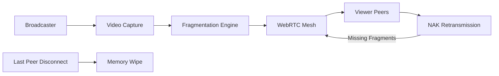
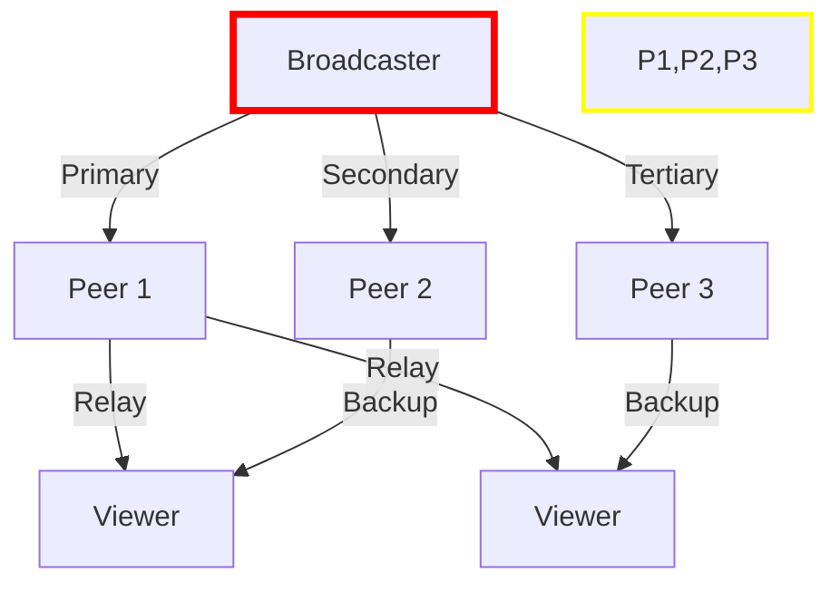
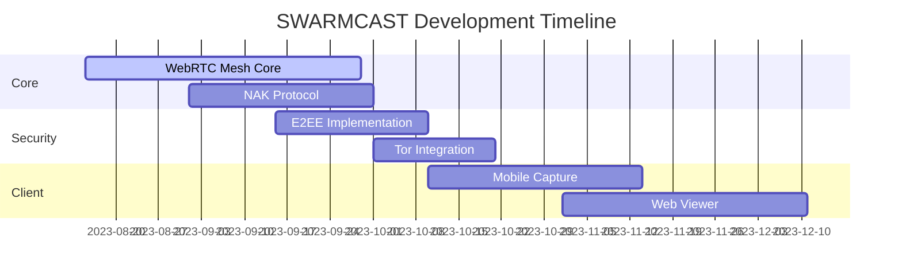

# SWARMCAST: Ephemeral P2P Live Streaming

> **Disappearing streams for high-risk broadcasts**  
> *Where video lives only as long as witnesses remain*

## 🌪️ Core Concept
SWARMCAST enables ultra-low-latency live streaming that:
- **Self-destructs** when the last viewer disconnects
- **Operates without servers** using WebRTC mesh networking
- **Prioritizes speed over quality** for real-time events
- **Leaves no forensic traces** after stream termination

Inspired by: `Periscope`'s immediacy + `BitTorrent Live`'s P2P + `Signal`'s ephemerality

## ⚡ Technical Architecture


### 🧠 Key Mechanics
| Component                  | Implementation Details                  | Latency Advantage       |
|----------------------------|-----------------------------------------|-------------------------|
**Fragmentation**          | 200ms GOP chunks with temporal SVC      | Enables frame-level repair |
**NAK Protocol**           | Negative acknowledgments for packet loss | 3x faster than ACK-based |
**Relay Optimization**     | STUN/TURN with latency-based scoring    | Sub-800ms end-to-end    |
**Swarm Handoff**          | Broadcast transfer to 3+ peers          | Survives source dropout |
**Ephemeral Storage**      | RAM-only buffer with zero swap          | Forensically sterile   |

## 🕒 Why Sub-Second Latency Matters
```diff
+ Protest Coordination: Real-time tactical updates
+ Guerrilla Art: Uninterruptible performances
+ Disaster Response: Immediate situation awareness
+ Live Sports: Betting-relevant immediacy
```

## 🔥 Signature Use Cases
1. **Civil Resistance**  
   - Police line movements streamed to 500+ protesters
2. **Censorship-Defiant Journalism**  
   - Warzone reporting with zero infrastructure
3. **Flash Mob Performances**  
   - Illegal raves with participatory streaming
4. **Critical Incident Documentation**  
   - Eyewitness streams during shootings or events where public safety suddenly becomes an immediate concern

## 📡 Network Topology


## ⚙️ Tech Stack
```bash
Core:          Node.js + WebRTC (wrtc)
Video:         WebCodecs API + SVC encoding
Networking:    Simple-Peer + GunDB for signaling
Security:      WebCrypto for E2EE (ChaCha20-Poly1305)
Fallback:      TOR hidden service for discovery
```

## 🧩 Challenges & Solutions
| Challenge                  | Our Approach                     |
|----------------------------|----------------------------------|
**Mobile Network Instability** | Forward Error Correction + Multi-path |
**Stream Bootstrapping**       | Pre-shared swarm keys via QR code |
**Metadata Protection**        | STUN/TURN over Tor onion services |
**Scale Limitations**          | Hybrid push-pull with 7-hop max  |
**Forensic Analysis**          | Memory-only storage + secure wipe |

## 🚀 MVP Roadmap


## 👥 Join the Stream Resistance
We need:
- **WebRTC Experts**: Low-level protocol optimization
- **Video Engineers**: SVC encoding specialists
- **Security Researchers**: Anti-forensic measures
- **UX Designers**: Crisis interface patterns

*Warning: This tool may be illegal in authoritarian regimes. Use accordingly.*
